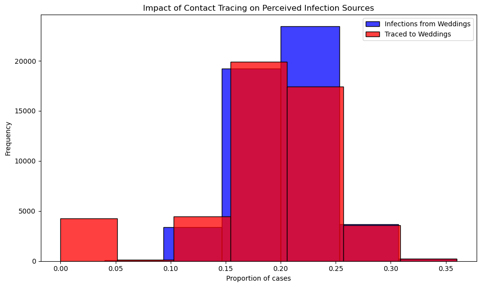

# ASSIGNMENT: Sampling and Reproducibility in Python

Read the blog post [Contact tracing can give a biased sample of COVID-19 cases](https://andrewwhitby.com/2020/11/24/contact-tracing-biased/) by Andrew Whitby to understand the context and motivation behind the simulation model we will be examining.

Examine the code in `whitby_covid_tracing.py`. Identify all stages at which sampling is occurring in the model. Describe in words the sampling procedure, referencing the functions used, sample size, sampling frame, any underlying distributions involved, and how these relate to the procedure outlined in the blog post.

Run the Python script file called whitby_covid_tracing.py as is and compare the results to the graphs in the original blog post. Does this code appear to reproduce the graphs from the original blog post?

Modify the number of repetitions in the simulation to 1000 (from the original 50000). Run the script multiple times and observe the outputted graphs. Comment on the reproducibility of the results.

Alter the code so that it is reproducible. Describe the changes you made to the code and how they affected the reproducibility of the script file. The output does not need to match Whitby’s original blogpost/graphs, it just needs to produce the same output when run multiple times

# Author: Amir Farimaniraad

```
Please write your explanation here...

The model simulates a population attending two types of events—weddings and brunches—and tracks COVID-19 infections and tracing efforts.

Event Population Sampling: This stage establishes a sample of 1,000 individuals, split between two event types: weddings (200 attendees) and brunches (800 attendees). The events represent a stratified sampling frame where each attendee is assigned based on fixed proportions, reflecting different social settings. This segmentation is achieved in the simulate_event function by initializing an events list and populating a DataFrame. The stratification aligns with the blog’s concept of high-risk clusters, like weddings, which can disproportionately contribute to tracing data due to their higher likelihood of transmission.

Infection Sampling: A subset of the 1,000 individuals is randomly selected for infection based on a 10% attack rate (ATTACK_RATE = 0.10), resulting in approximately 100 infected people across both event types. The selection uses a uniform random sampling approach, with np.random.choice() randomly marking individuals as infected. This stage ensures a roughly unbiased spread of infections among attendees, capturing a baseline infection rate independent of event type. In line with the blog’s discussion, this sampling represents an equal potential for infection across different gatherings, though not all sources may appear equally due to tracing biases.

Primary Contact Tracing Sampling: This sampling targets only the infected individuals, selecting a 20% subset for successful tracing based on TRACE_SUCCESS = 0.20. Each infected person has a binomial probability (success/failure) of being traced, implemented through a random number comparison (np.random.rand() < TRACE_SUCCESS). This stage simulates the initial tracing attempt, emphasizing that only a fraction of infections are traceable. It aligns with the blog’s exploration of contact tracing, showing how incomplete tracing can influence data by selectively identifying certain event clusters.

Secondary Contact Tracing Sampling: This stage broadens tracing within events where at least two attendees have been traced, which typically skews results toward high-contact events like weddings. Conditional sampling increases tracing for any infected individuals attending events that meet this threshold. This approach reinforces clusters in high-contact settings, thereby overrepresenting them in tracing data, reflecting the bias highlighted in the blog. Through event-level tracing thresholds, this stage captures how clusters can inadvertently amplify perceived transmission sources, aligning with the blog’s discussion on tracing biases in overrepresented social settings.


comparing the code as is to the results to the graphs on the blog post : 


when running the code as is, does not fully reproduce the graph from the original blog post. In the blog post, the "true proportion" of infections from weddings is narrowly centered around 0.2, while the "observed proportion" due to contact tracing is a broader, right-skewed distribution that reaches higher proportions, illustrating a bias towards overrepresenting weddings. In contrast, the figure generated by the script shows both distributions concentrated around the 0.15-0.25 range, with less spread and no strong skew, suggesting that the script’s parameters or sampling methods may differ from those used in the blog, resulting in a less pronounced bias effect.

When the number of repetitions reduced to 1,000 (from the original 50,000) and no fixed random seed, the outputted graphs will vary with each run. This variability is expected because, without a seed, each run generates a new set of random values for infection and tracing, leading to different sampling outcomes.

After adding a fixed random seed, the simulation produces the same figure with each run. This consistency occurs because the random seed controls the sequence of random numbers, ensuring that the infection and tracing outcomes remain identical in every execution. By setting a seed, the simulation becomes reproducible, allowing for stable and predictable results
```


## Criteria

|Criteria|Complete|Incomplete|
|--------|----|----|
|Altercation of the code|The code changes made, made it reproducible.|The code is still not reproducible.|
|Description of changes|The author explained the reasonings for the changes made well.|The author did not explain the reasonings for the changes made well.|

## Submission Information

🚨 **Please review our [Assignment Submission Guide](https://github.com/UofT-DSI/onboarding/blob/main/onboarding_documents/submissions.md)** 🚨 for detailed instructions on how to format, branch, and submit your work. Following these guidelines is crucial for your submissions to be evaluated correctly.

### Submission Parameters:
* Submission Due Date: `HH:MM AM/PM - DD/MM/YYYY`
* The branch name for your repo should be: `sampling-and-reproducibility`
* What to submit for this assignment:
    * This markdown file (sampling_and_reproducibility.md) should be populated.
    * The `whitby_covid_tracing.py` should be changed.
* What the pull request link should look like for this assignment: `https://github.com/<your_github_username>/sampling/pull/<pr_id>`
    * Open a private window in your browser. Copy and paste the link to your pull request into the address bar. Make sure you can see your pull request properly. This helps the technical facilitator and learning support staff review your submission easily.

Checklist:
- [ ] Create a branch called `sampling-and-reproducibility`.
- [ ] Ensure that the repository is public.
- [ ] Review [the PR description guidelines](https://github.com/UofT-DSI/onboarding/blob/main/onboarding_documents/submissions.md#guidelines-for-pull-request-descriptions) and adhere to them.
- [ ] Verify that the link is accessible in a private browser window.

If you encounter any difficulties or have questions, please don't hesitate to reach out to our team via our Slack at `#cohort-3-help`. Our Technical Facilitators and Learning Support staff are here to help you navigate any challenges.
